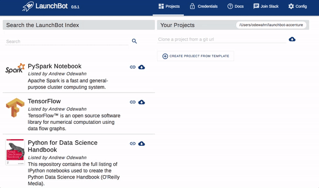

# Computational Publishing with Jupyter

<hr/>
This is draft for an article I'm working on for O'Reilly Media about the Jupyter Publishing landscape.  If you have any thoughts you'd care to share, please post an issue at [odewahn/computational-publishing](https://github.com/odewahn/computational-publishing).
<hr/>

As first described in [Embracing Jupyter Notebooks at O'Reilly](https://www.oreilly.com/ideas/jupyter-at-oreilly), Jupyter is a critical tool.  Time has only strengthened this conviction -- I'd wager that Jupyter is on the shortlist for the most important tool for technical publishers since the Laser Writer and Aldus PageMaker.

But, perhaps more importantly, Jupyter is critical not just for capital P "Publishing" and "Publishers".  It's useful in any content where people need to analyze data and share their conclusions.  In other words, people in nearly all job categories that involve making and sharing decisions.

The reason?  Jupyter is one of the first computation-native *authoring* tools, as opposed to a bespoke software development process, that delivers on Seymour Papert's [constructivist](http://www.papert.org/articles/SituatingConstructionism.html) vision. Explored in a modern digital context in Brett Victor's seminal 2011 essay [Explorable Explanations](http://worrydream.com/ExplorableExplanations/), as well as [Lorena Barba](http://lorenabarba.com/)'s vision of [computable content](https://bids.berkeley.edu/events/computational-thinking-and-pedagogy-computable-content), Papert and hit intellectual descendants convincingly argue that people understand and learn best by actively making and doing, versus passively reading, listening, or watching.  


(Brett Victor / [Explorable Explanations](http://worrydream.com/ExplorableExplanations/))

As we [surveyed the landscape of tools](http://odewahn.github.io/patterns-of-code-as-media/www/introduction.html), the Jupyter ecosystem has emerged as the leading toolset that addresses many thorny issues:

* Simple support for new interaction models.  Jupyter provides a plug-in architecture that allows the community to easily add new features, such as plotting, mapping, or data visualization.
* Mixed video, text, and assessment.  A Jupyter document can consist of a rich set of media of all types.  Basically, anything that run in a browser will run in Jupyter.
* Code + data.  Combining a notebook with a tool like git or [dat](https://datproject.org/) allows you to easily bundle your data with your code.  This is especially critical for scientific and visualization work.
* Collaboration.  With git and github, you can package your content and all assets and post them to the many public git hosting services, such as GitHub, BitBucket, or GitLab.
* Multi-language support.  Jupyter's kernel-based design means that new languages and services are relatively easy to incorporate.
* Discovery and citation.  Services like [Zenodo](https://zenodo.org/) make it simple to assign DOIs to Notebook content so that they can be cited in scholarly publications.
* Reproducibility and preservation.  You need to only add a Dockerfile (or an equivalent tool, like Ansible playbooks) to specify the project's dependencies in order to fully recreate the environment required for the Notebook content to run.  And, since these are stored as Git files, it is simple to keep the content around so that you can reconstruct at any time, as opposed to keeping the running environment.

### Challenges

Clearly, Jupyter provides a host of benefits and opportunities.  However, despite the promise, its widespread adoption outside the programming, scientific, and data science community has been hindered by the relatively high barriers to entry of the overall ecosystem.

As a tool built by hackers for hackers, realizing the full potential of Jupyter requires the user to understand several tools typically used in software engineering.  For authors used to working in Word or Google Docs, Jupyter's reliance on Git, GitHub, package managers, and software configuration tools can be a overwhelming.  The gap is magnified when it's applied outside of a purely technical area, such as biology, economics, journalism, or library sciences.

In addition to the steep learning curve, our experience in trying to build a robust workflow for publishing with Jupyter indicates that even very technical and experienced authors have a hard time creating reproducible environments.  This usually manifests in a broken library or call within a notebooks (i.e., the content uses something that is not on the base image).  "Works on my machine" is not just for developers any more.

## A Model for Computational Publishing

To understand how to tackle the challege of building a publishing program around Jupyter, I've developed a four-part model to understand the ecosystem:


The following sections detail the each of the following components:

* Source content
* Machine image
* Runtime engine
* File sharing

### Source Content

The source content is largely about how you manage the source files that make up the project.  This consists not only of your text content, but also any data, images, or configuration files.  Our experience largely boils down to the following three principles:

* Version control with git
* Structured markup
* Transformation engines

The following sections explore each in more detail.

#### Version control in git

The [git version control system](https://git-scm.com/) should be the basis of any modern publishing workflow. Git provides a number of benefits, including:

* Change tracking.  Git can track even the tiniest change to every file, allowing you to precisely identify the every commit project commit.
* Collaboration.  Tools like GitHub, BitBucket, or GitLab allow you to easily share project repositories at whatever granularity of security you desire.
* Access to GitHub.  Especially in technical contexts, it is essential to be able to publish on GitHub, which is increasingly becoming the main place for sharing content and finding collaborators.

Despite its reputation, working with git and GitHub (or BitBucket, or GitLab) is fairly straightforward:

* *Clone*.  Begin by cloning the git repository to their local machine using its _git URL_.  The git URL is a bit like a web url, but can have two main formats: an `ssh` format and an `https` format.  Also, since git is a distributed format, the same repository can be published at multiple places and have different URLs.  This is perhaps one of the hardest concepts to grasp. Unlike a google doc, there is no single source of truth.  Rather, you work locally, and then "push" the content back to its origin, where you reconcile any conflicting changes
* *Create a branch*.  Once you've cloned a repo, you next start a new branch.  A branch should typically represent a logical unit of work, like a copyedit or a description.
* *Add files and commit*.  Assuming you're happy with the work you've made in your branch.  You add and commit your changed files.
* *Push changed branch back to your remote*.  Once you've committed your files, you push the local changes back up to the "origin" from which you cloned the project.
* *Open a pull request*. Once you've pushed your changes, you submit a pull request which alerts other collaborators to your change.  They can then review it and comment, and (once everyone is satisfied) merge your changes back into the "master" branch.

In general, this is called the the [github workflow](https://guides.github.com/introduction/flow/), and works best when you have multiple collaborators on a  project.

If you're early on the project, or just don't want to bother with branching, you can always just clone a repo and work directly in master.  The main issue with this approach is that it becomes harder to unwind complex changes, but if you're thoughtful about your work process, you can usually get quite far this way.

#### Structured Markup

The next core principle is to use structured markup in your content.  You have a number of options to choose from:

* [Markdown](https://daringfireball.net/projects/markdown/).  One of the original simple text markup languages, Markdown is a bit like wirting a glorified email, where lists are bullets, bold is denoted by asterisks, and headers by a "#" symbol.  Markdown is great for shorter articles.
* [GitHub flavored markdown](https://guides.github.com/features/mastering-markdown/).  The basic markdown syntax, but with some extra features for marking up code, tasks, tables, and other more complex strutures.
* [AsciiDoc](http://asciidoc.org/).  A full featured markup syntax based on [DocBook](http://docbook.org/) (see below) that handles the complex structures required for book-length texts that require cross-referencing, bibliographic material, sections, asides, indexes, and a host of other complex features.
* [reStructured text](http://docutils.sourceforge.net/rst.html).  Basically, the same idea as Markdown, but adopted heavily by the Python community.
* [HTMLBook](https://github.com/oreillymedia/HTMLBook).  A set of HTML5 tags and classes developed by O'Reilly Media for publishing.
* [DocBook](http://docbook.org/).  An XML-based markup language for technical documentation.  It was originally developed at O'Reilly Media in the mid-1990s, but is now part of the  [OASIS](https://www.oasis-open.org/) standards.

Jupyter stores content in a  [json](http://www.json.org/)-based format called [ipynb](https://ipython.org/ipython-doc/3/notebook/nbformat.html).  A notebook document consists of an array of cells that (generally) contain either markdown or code (and the output of the code), along with some additional metadata.

#### Transformation engines

One of the key reasons for using a structured markup is to enable the third key principle: using a transformation engine to convert the content from its source form into a format suitable for distribution.  [Static site generators](https://www.staticgen.com/), which typically convert repositories posted to GitHub into a website, are the most common type of transformation engines:

* [Jekyll](http://jekyllrb.com/)
* [Hugo](http://gohugo.io/)
* [Hexo](https://www.staticgen.com/hexo)
* [GitBook](https://www.gitbook.com/)

Jupyter's [nbonvert](https://nbconvert.readthedocs.io/en/latest/), a command-line tool called  that can transform the `ipynb` format to a variety of other formats, is the core tool for building transformation engines for the `ipynb` format. Here's an example:

```
jupyter nbconvert --to FORMAT notebook.ipynb
```

Formats include 'html', 'latex', 'markdown', 'pdf', 'python', 'rst', 'script', 'slides'.  (You can also include a custom format based on templates you create.)

### Machine Image

Once you have a system for managing the source content, the next element in the computational publishing process is to build a machine image that describes the environment required to run the content.  This is a key difference from other publishing processes, where the content is static: for Jupyter to work, you must be able to reproduce a working environment.

A `machine image` is a way to create a complete description of a computing environment.  In the context of computational publishing, this means specifying to distinct sets of dependencies:

* Jupyter dependencies
* Content-specific dependencies

While there are still other alternatives, such a [Rocket](https://coreos.com/rkt) from CoreOS, the Jupyter community is generally settling around Docker as a standard format for representing a machine image.

#### Jupyter Dependencies

The Jupyter dependencies consist of basically everything required for the Jupyter Notebook application itself.  Generally, this is the satisfied by installing the [Anaconda](https://www.continuum.io/downloads) framework from [Continuum Analytics](https://www.continuum.io).

#### Content Dependencies

In addition to the dependencies required to run the notebook application itself, a content project will often require a number of OS and language specific dependencies that are unique to the topic under consideration.  For example, if you're writing about machine learning with Python, you might require word2vec, nltk, and scikit-learn.

Generally, installing these packages requires an OS-specific solution and a language-specific package manager.  The following table summarize the many choices here:  

| Platform  | Packaging System      |
|-----------|-----------------------|
|OS         | yum, apt, brew, choco |
|Python     | pip, conda            |
|Node       | npm, yarn             |
|R          | cran                  |
|Go         | dep                   |
|Ruby       | gem                   |


#### Docker as an Emerging Solution

The Jupyter community has begun to standardize on [Docker](https://www.docker.com/) as a way to represent a machine image.  The [Docker stacks](https://github.com/jupyter/docker-stacks) project, perhaps the most visible manifestation of this convergence, is a set of increasingly specialized layers of Docker images that for a variety of computing scenarios.


(Jupyter Project/[Docker Stacks](https://github.com/jupyter/docker-stacks/))

Using the Docker Stacks as a base image, a user can easily layer on content-specific dependencies into a Dockerfile with a few simple commands.  Here's an example:

```
FROM jupyter/scipy-notebook:latest

# Install an OS dependency with apt
USER root
RUN apt-get update && apt-get install -y ffmpeg
USER jovyan

# Install a language dependency with pip
RUN pip install -y word2vec

# Expose the notebook port
EXPOSE 8888

# Start the notebook server
CMD jupyter notebook --no-browser --port 8888 --ip=*

```

Combining the right base image with the language/OS-specific package managers in the Dockerfile is quickly emerging as a defacto standard in the community for specifying a project's machine image.  

As an additional benefit, adding the  Dockerfile to the project creates a simple way to link the machine image to the content in a way that is simple to version and track using git.

### Runtime Engine

Although important, merely specifying a machine image is not enough.  In order to use a project, you also need a container that runs the Notebook application itself.

There are many options for running the notebook. The following figure breaks some of the many possible approaches:


The figure is broken down along two major axes:

* Whether the runtime is for a single-user of multi-users
* Whether the runtime is based on a local machine, or the cloud

In Quadrant 1, we have single user solution running on a host machine, such as a local laptop.  This scenario is generally for the user who installs Jupyter using Conda on his or her laptop, and then uses Conda (or pip) to install the content specific dependencies.  While this is a relatively simple setup, it makes it difficult to share the setup for the computing environment, and often requires an additional isolation tool (like [virtualenv](https://virtualenv.pypa.io/en/stable/)) to isolate the different version of libraries and python versions across content projects.

Quadrant 2 represents a multiuser environment deployed in the user's own datacenter or cloud account.  Solutions like [JupyterHub](https://github.com/jupyterhub/jupyterhub) or [Binder](http://mybinder.org/) make it simple for a central administrator or IT organization to provide a "notebook on demand," eliminating the need for a complex local install.  The downside to this approach is that it requires a central administration with the expertise to install and operate the cluster.

Quadrant 3 is for a single user system running on a VM or container solution on a local laptop, such as [Docker for Mac](https://docs.docker.com/docker-for-mac/) or [VirtualBox](https://www.virtualbox.org/manual/ch01.html).  The advantage of this approach is that a user can easily build and deploy an image on his own laptop with just a single Dockerfile (if Docker is used as described in the previous section).  The downside is that it can take an extra level of training on the part of the user to understand the software stacks involved to operate it effectively.

Finally, Quadrant 4 is for multiuser solutions in a pure cloud. The best examples are Microsoft's [Azure Notebooks](https://notebooks.azure.com/) and the [Domino DataLab](https://www.dominodatalab.com/).  The advantage of these solutions is that they provide a turnkey way to easily provide a large user population with notebooks, but the downside is (often) expense, vendor lock-in, and (often) the inability to use git in the workflow.

### File Sharing

The final aspect of the computational publishing workflow is a way to save changes made to the content within the running container back to the source content.  In other words, we want to ensure that when a user makes a change in the notebook and hits save, those changes are made to the local git repo, and not to the ephemeral filesystem in a container.  

Docker provides a number of ways to do this, such as [volume mounting](https://docs.docker.com/engine/tutorials/dockervolumes/), and cloud solutions provide their own storage backends.  Other container solutions, such as [Binder](http://mybinder.org/) or [tmpnb](https://github.com/jupyter/tmpnb), do not persist user changes automatically.

### LaunchBot: Lowering the Barriers to Entry for Computational Publishing

As the previous section illustrates, the Jupyter Notebook application itself is just one part of the overall publishing process.  To be effective, a user must also understand git and GitHub, dependency management, and a variety of other disjointed tools.

I've been incubating a new tool at O'Reilly called [LaunchBot](https://launchbot.io/) to help lower these barriers to entry.  Launchbot is a desktop client that provides three essential services:

* Discovery.  People creating content can easily list their projects in a central index to make the discoverable.  A project is just a git repository with a Dockerfile that describes the machine image.  The Dockerfile also needs a few [labels that LaunchBot uses when starting the project](http://launchbot.io/docs/tutorial/publishing-content-to-launchbot/).
* Git functionality.  LaunchBot enables users to easily clone and manage content projects.  Once cloned, the UI supports the essential git workflow of branching, committing (or stashing), and pulling and pushing to remote repositories.
* Docker functionality.  Finally, LauncBot can build and deploy the project to your a local Docker engine so that you can have a running container.  It establishes a volume mount from the container back to your project directory so that all changes made as you edit the notebook are saved into the local project directory.  



LaunchBot's key advantages include:

* No need for new training.  Launchbot provides a layer of command line tools like git and docker, reducing the overall learning curve required for using Jupyter projects.  While you can certainly (and should!) learn the individual commands, LaunchBot allows users of all levels to quickly and easily get started with new content.
* No need for central IT support or operations.  Deploying the container runtime on the local machine via Docker for Mac (and soon Docker for Windows) reduces the need for a centralized system like JupyterHub, which requires a skilled IT team to install and operate.
*  Automation without lock-in.  Launchbot automates commands that you could type yourself.  There is nothing it does that could not be done by someone with sufficient training in the underlying tools, so you have no fear of lock-in as you might with some pure cloud providers.
