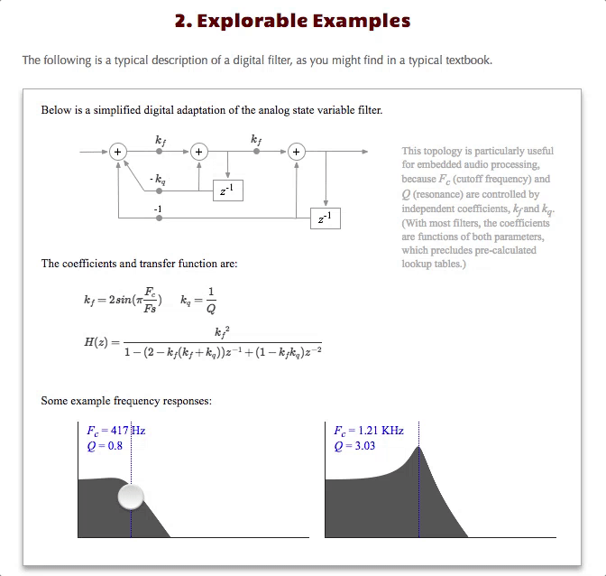
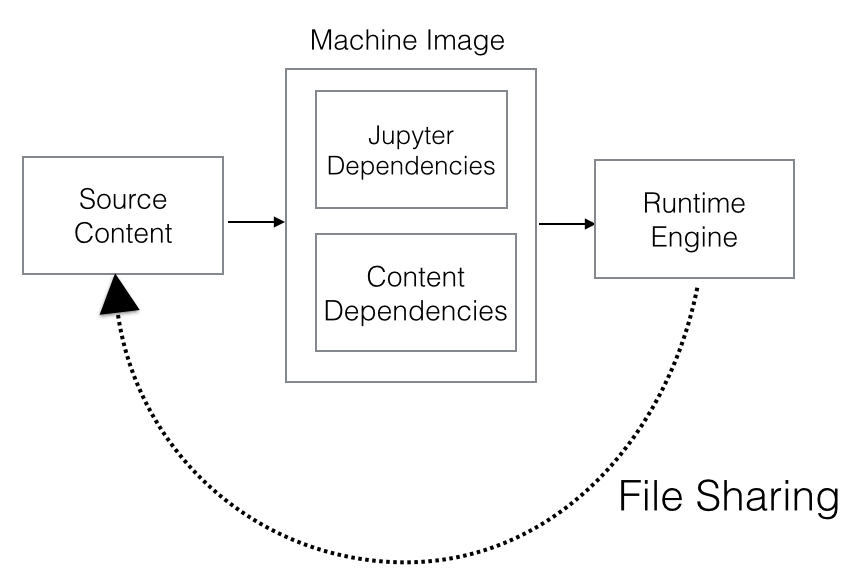
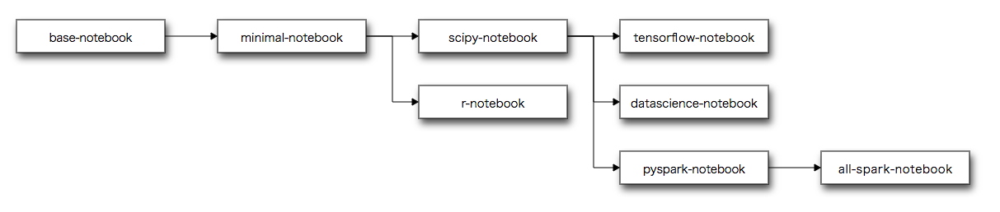
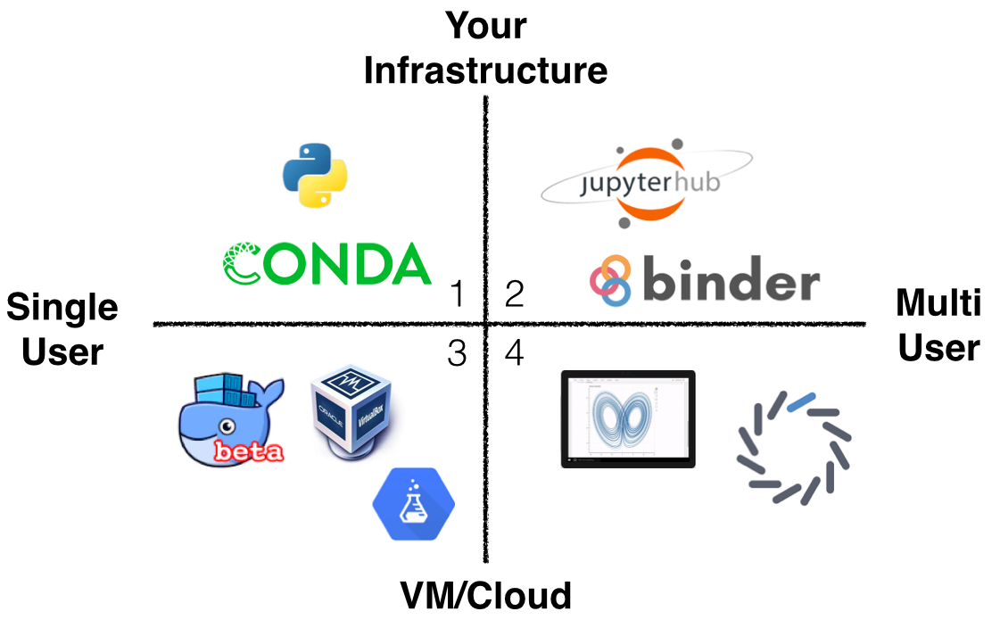

# Computational Publishing with Jupyter

As first described in [Embracing Jupyter Notebooks at O'Reilly](https://www.oreilly.com/ideas/jupyter-at-oreilly), Jupyter is a critical tool.  Time has only confirmed it -- I'd wager that Jupyter is on the shortlist as the most important tool for technical publishers since the Laser Writer and Aldus PageMaker.

The reason?  Jupyter is one of the first digital *authoring* tools, as opposed to a bespoke software development process, that delivers on Seymour Papert's [constructivist](http://www.papert.org/articles/SituatingConstructionism.html) vision.

Papert's ideas, explored in a modern digital context in Brett Victor's seminal 2011 essay [Explorable Explanations](http://worrydream.com/ExplorableExplanations/), as well as [Lorena Barba](http://lorenabarba.com/)'s vision of [computable content](https://bids.berkeley.edu/events/computational-thinking-and-pedagogy-computable-content), posits that people learn best by actively making and doing, versus passively reading, listening, or watching.  


_Brett Victor / [Explorable Explanations](http://worrydream.com/ExplorableExplanations/)_

As we [surveyed the landscape of tools](http://odewahn.github.io/patterns-of-code-as-media/www/introduction.html), the Jupyter ecosystem has emerged as the leading toolset that addresses many thorny issues:

* Simple support for new interaction models.  Jupyter provides a plug-in architecture that allows the community to easily add new features, such as plotting, mapping, or data visualization.
* Mixed video, text, and assessment.  A Jupyter document can consist of a rich set of media of all types.  Basically, anything that run in a browser will run in Jupyter.
* Code + data.  Combining a notebook with a tool like git or dat allows you to easily package your code and data.
* Collaboration.  With git and github, you can package your content and all assets and post them to the many public git hosting services, such as GitHub, BitBucket, or GitLab.
* Multi-language support.  Jupyter's kernel-based design means that new languages and services are relatively easy to incorporate.
* Discovery and citation.  Services like [Zenodo](https://zenodo.org/) make it simple to assign DOIs to Notebook content so that they can be cited in scholarly publications.
* Reproducibility and preservation.  You need to only add a Dockerfile or some other mechanism to specify the project's dependencies (such as the appropriate Ansible playbooks) in order to fully recreate the environment required for the Notebook content to run.  And, since these are stored as Git files, it is simple to keep the content available so that you can reconstruct at any time, as opposed to keeping the running environment.

SOMETHING THAT TIES THIS BEYOND PUBLISHING TO A GENERAL SET OF COLBORATION AND SHARING IN A COMPUTATION-HEAVY ENVIRONMENT.

### Challenges

Clearly, Jupyter provides a host of benefits and opportunities.  However, despite the promise, it's widespread adoption outside the programming, scientific, and data science community has been hindered by its relatively high barriers to entry of the overall ecosystem.

As a tool built by hackers for hackers, realizing the full potential of Jupyter requires the user to understand several tools typically used in software engineering.  For authors used to working in Word or Google Docs, Jupyter's reliance on Git, GitHub, package managers, and software configuration tools can be a overwhemling.  This is magnified when the tool is moved outside a purely technical area, such as biology, economics, journalism, or library sciences.

In addition to the steep learning curve, our experience in trying to build a robust workflow for publishing with Jupyter indicates that even very technical and experienced authors have a hard time creating reproducible environments.  This usually manifests in a broken library or call within a notebooks (i.e., the content uses something that is not on the base image).

## A Model for Computational Publishing

We've developed a four-part model to help us realize Jupyter's potential:



The following sections detail the each of the following components:

* Source content
* Machine image
* Runtime engine
* File sharing

### Source Content

The source content is largely about how you manage the source files that make up the project.  This consists not only of your text content, but also any data, images, or configuration files.  Our experience largely boils down to the following three principles:

* Version control with git
* Structured markup
* Transformation engines

The following sections explore each in more detail.

#### Version control in git

The [git version control system](https://git-scm.com/) should be the basis of any modern publishing workflow. Git provides a number of benefits, including:

* Change tracking.  Git can track even the tiniest change to every file, allowing you to precisely identify the every commit project commit.
* Collaboration.  Tools like GitHub, BitBucket, or GitLab allow you to easily share project repositories at whatever granularity of security you desire.
* Access to GitHub.  Especially in technical contexts, it is essential to be able to publish on GitHub, which is increasingly becoming the main place for sharing content and finding collaborators.

Despite its reputation, working with git and GitHub (or BitBucket, or GitLab) is fairly straightforward:

* *Clone*.  Begin by cloning the git repository to their local machine using its _git URL_.  The git URL is a bit like a web url, but can have two main formats: an `ssh` format and an `https` format.  Also, since git is a distributed format, the same repository can be published at multiple places and have different URLs.  This is perhaps one of the hardest concepts to grasp. Unlike a google doc, there is no single source of truth.  Rather, you work locally, and then "push" the content back to its origin, where you reconcile any conflicting changes
* *Create a branch*.  Once you've cloned a repo, you next start a new branch.  A branch should typically represent a logical unit of work, like a copyedit or a description.
* *Add files and commit*.  Assuming you're happy with the work you've made in your branch.  You add and commit your changed files.
* *Push changed branch back to your remote*.  Once you've committed your files, you push the local changes back up to the "origin" from which you cloned the project.
* *Open a pull request*. Once you've pushed your changes, you submit a pull request which alerts other collaborators to your change.  They can then review it and comment, and (once everyone is satisfied) merge your changes back into the "master" branch.

In general, this is called the the [github workflow](https://guides.github.com/introduction/flow/), and works best when you have multiple collaborators on a  project.

If you're early on the project, or just don't want to bother with branching, you can always just clone a repo and work directly in master.  The main issue with this approach is that it becomes harder to unwind complex changes, but if you're thoughtful about your work process, you can usually get quite far this way.

#### Structured Markup

The next core principle is to use structured markup in your content.  You have a number of options to choose from:

* [Markdown](https://daringfireball.net/projects/markdown/).  One of the original simple text markup languages, Markdown is a bit like wirting a glorified email, where lists are bullets, bold is denoted by asterisks, and headers by a "#" symbol.  Markdown is great for shorter articles.
* [GitHub flavored markdown](https://guides.github.com/features/mastering-markdown/).  The basic markdown syntax, but with some extra features for marking up code, tasks, tables, and other more complex strutures.
* [AsciiDoc](http://asciidoc.org/).  A full featured markup syntax based on [DocBook](http://docbook.org/) (see below) that handles the complex structures required for book-length texts that require cross-referencing, bibliographic material, sections, asides, indexes, and a host of other complex features.
* [reStructured text](http://docutils.sourceforge.net/rst.html).  Basically, the same idea as Markdown, but adopted heavily by the Python community.
* [HTMLBook](https://github.com/oreillymedia/HTMLBook).  A set of HTML5 tags and classes developed by O'Reilly Media for publishing.
* [DocBook](http://docbook.org/).  An XML-based markup language for technical documentation.  It was originally developed at O'Reilly Media in the mid-1990s, but is now part of the  [OASIS](https://www.oasis-open.org/) standards.

Jupyter stores content in a  [json](http://www.json.org/)-based format called [ipynb](https://ipython.org/ipython-doc/3/notebook/nbformat.html).  A notebook document consists of an array of cells that (generally) contain either markdown or code (and the output of the code), along with some additional metadata.

#### Transformation engines

One of the key reasons for using a structured markup is to enable the third key principle: using a transformation engine to convert the content from its source form into a format suitable for distribution.  [Static site generators](https://www.staticgen.com/), which typically convert repositories posted to GitHub into a website, are the most common type of transformation engines:

* [Jekyll](http://jekyllrb.com/)
* [Hugo](http://gohugo.io/)
* [Hexo](https://www.staticgen.com/hexo)
* [GitBook](https://www.gitbook.com/)

Jupyter's [nbonvert](https://nbconvert.readthedocs.io/en/latest/), a command-line tool called  that can transform the `ipynb` format to a variety of other formats, is the core tool for building transformation engines for the `ipynb` format. Here's an example:

```
jupyter nbconvert --to FORMAT notebook.ipynb
```

Formats include 'html', 'latex', 'markdown', 'pdf', 'python', 'rst', 'script', 'slides'.  (You can also include a custom format based on templates you create.)

### Machine Image

Once you have a system for managing the source content, the next element in the computational publishing process is to build a machine image that describes the environment required to run the content.  This is a key difference from other publishing processes, where the content is static: for Jupyter to work, you must be able to reproduce a working environment.

A `machine image` is a way to create a complete description of a computing environment.  In the context of computational publishing, this means specifying to distinct sets of dependencies:

* Jupyter dependencies
* Content-specific dependencies

While there are still other alternatiecs, such a [Rocket](https://coreos.com/rkt) from CoreOS, the Jupyter community is generally settling around Docker as a standard format for representing a machine image.

#### Jupyter Dependencies

The Jupyter dependencies consist of basically everything required for the Jupyter Notebook application itself.  Generally, this is the satisfied by installing the [Anaconda](https://www.continuum.io/downloads) framework from [Continuum Analytics](https://www.continuum.io).

#### Content Dependencies

In addition to the dependencies required to run the notebook application itself, a content project will often require a number of OS and language specific dependencies that are unique to the topic under consideration.  For example, if you're writing about machine learning with Python, you might require word2vec, nltk, or scikit-learn.

Generally, installing these packages requires an OS-specific solution (like `apt`) or a language-specific package manager (like `conda`).  

The following table shows just a few of the many options a project might require.

| Platform  | Packaging System      |
|-----------|-----------------------|
|OS         | yum, apt, brew, choco |
|Python     | pip, conda            |
|Node       | npm, yarn             |
|R          | cran                  |
|Go         | dep                   |
|Ruby       | gem                   |


#### Docker as an Emerging Solution

The Jupyter community has begun to standardize on [Docker](https://www.docker.com/) as a way to represent a machine image.  The [Docker stacks](https://github.com/jupyter/docker-stacks) project, perhaps the most visible manifestation of this convergence, is a set of increasingly specialized layers of Docker images that for a variety of computing scenarios.


_Jupyter Project/[Docker Stacks](https://github.com/jupyter/docker-stacks/)_

Using the Docker Stacks as a base image, a user can easily layer on content-specific dependencies into the Dockerfile with a few simple commands.  For example:

```
FROM jupyter/scipy-notebook:latest

USER root
# Install content-specific dependencies
# ffmpeg is no longer available in Jesse: https://wiki.debian.org/ffmpeg
# However, it is in backports
# This Dockerfile installs it; from https://hub.docker.com/r/themylogin/docker-ffmpeg/~/dockerfile/
RUN sed -i "s/jessie main/jessie main contrib non-free/" /etc/apt/sources.list
RUN echo "deb http://http.debian.net/debian jessie-backports main contrib non-free" >> /etc/apt/sources.list
RUN apt-get update && apt-get install -y ffmpeg
USER jovyan

# Expose the notebook port
EXPOSE 8888

# Start the notebook server
CMD jupyter notebook --no-browser --port 8888 --ip=*

```

Combining the right base image with the language/OS-specific package managers in the Dockerfile is quickly emerging as a defacto standard in the community for specifying a project's machine image. 

### Runtime Engine



### File Sharing

### LaunchBot: Lowering the barriers to entry

### Support in Safari

* [Assessments](https://www.oreilly.com/learning/why-self-assessments-improve-learning)
